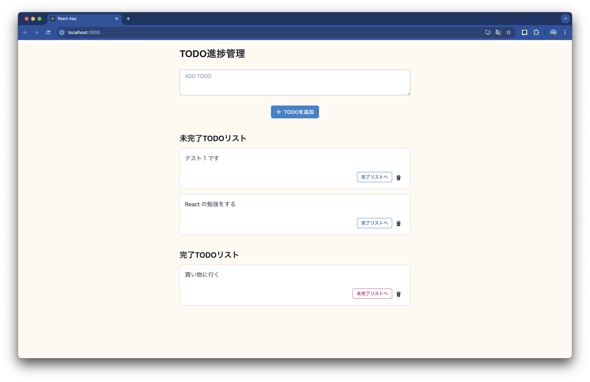
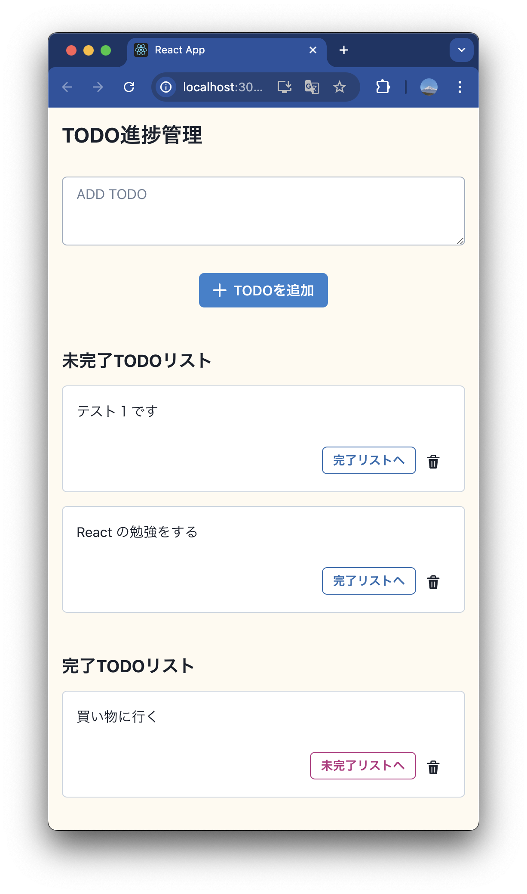

# 概要
「基礎から学ぶ React/React Hooks」の「37 Chakra UIのコンポーネントを利用しよう」のコード（改）です。

# 構成

- Frontend
    - React(Javscript) + Chakra UI
- backend
    - JSON Server

# 実行方法

## パッケージインストール

% npm install

## JSON Server を実行

% npx json-server --watch db.json --port 3100

## TODOアプリ を実行 React + Vite

% npm run dev

## 実行画面

